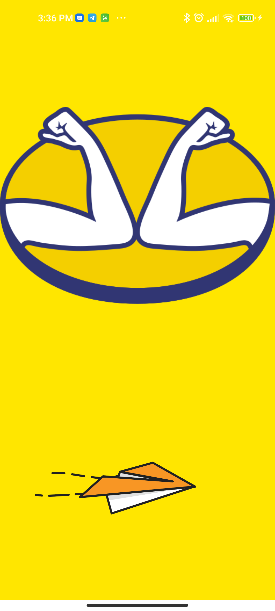
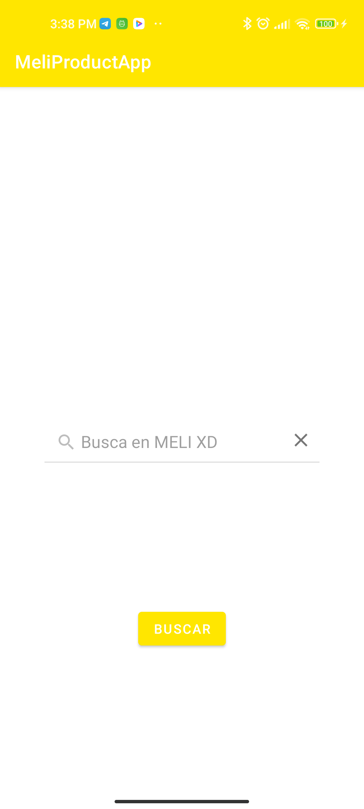
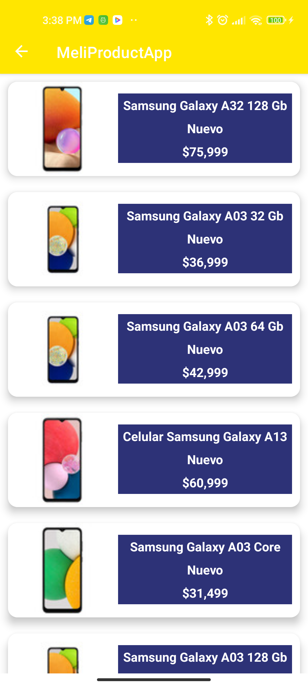
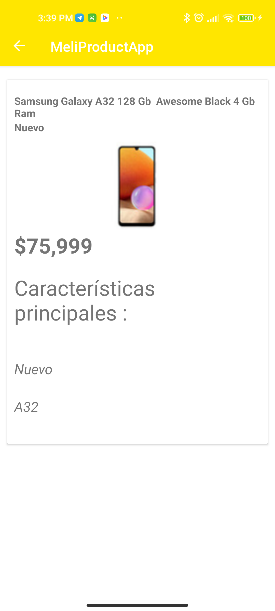
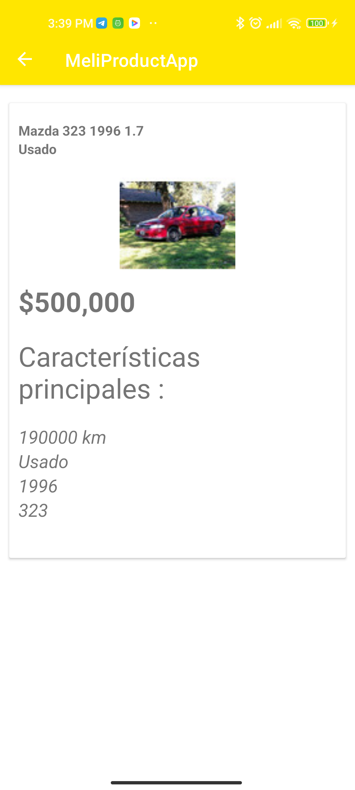

# Mercadolibre Mobile App Challenge

## Experiencia de usuario

Este proyecto contiene las siguientes características.

* Splash Screen MELI
* Una pantalla de inicio con una barra de busqueda para buscar en MELI
* Un listado de productos con el resultado de la busqueda
* Una pantalla que muestra el detalle del producto seleccionado

## Capturas de pantalla

  
  

  
  

  

## implementación

### API de Meli

Este proyecto implementa la API : https://api.mercadolibre.com/sites/MLA/

### Arquitectura

Este proyecto implementa la arquitectura limpia (Clean Architecture) 

#### Capas

* App: UI.
* Presentación: View Models.
* Casos de uso: GetProductsByQueryUseCase
* Dominio: ProductEntity, AttributesEntity
* Datos: ProductRepository, RemoteProductDataSource
* Framework: ImageManager, RequestManager.

#### Test unitarios

Se implementan test en las capas : Presentation, Data y Use cases

### Administrador de solicitudes: 

Retrofit

### Biblioteca de imágenes 

Glide

### Inyección de dependencia - Dagger

Dagger